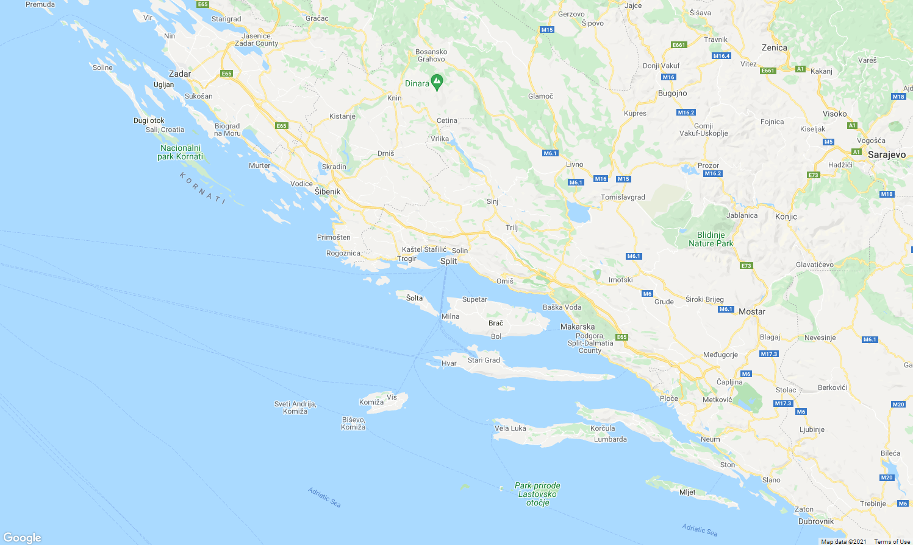

# Jaki rejs?
Najprawdziwszy rejs, najprawdziwszymi jachtami, wyczarterowanymi i prowadzonymi przez nas, bez żadnych obcych kapitanów, instruktorów kulturalno-oświatowych, animatorów czasu wolnego, czy kierowników wycieczek.

Zbieramy ludzi z MP (kto chce to może z dowolną liczbą osób towarzyszących) i w ciągu dnia pływamy dwoma (na razie) dużymi katamaranami pomiędzy wyspami Chorwacji, pijąc zimne napoje w pełnym słońcu; słysząc tylko odgłos fal uderzających o kadłub napędzanego wiatrem statku. Wieczorami stajemy obok siebie w marinach i odpoczywamy, albo idziemy w miasto.

Będą okazje do zobaczenia kilku naprawdę fajnych miejsc, wyskoczenia z jachtu stojącego na kotwicy do morza i pływania w jeszcze w miarę ciepłym adriatyku, integracji i poznania - rozentuzjazmowanych okolicznościami - znajomych z pracy od mniej profesjonalnej strony, zapoznania się z ogólnie pojętym żeglarstwem, przepisami, prowadzeniem jachtu, piciem alkoholu... W którąś noc pewnie zwiążemy ze sobą dwa katamarany i rzucimy kotwice w środku zatoki.

Myślę, że spokojnie można powiedzieć (a Ci, którzy już z nami pływali na pewno chętnie potwierdzą), że szykuje się *impreza roku*. Docelowy skład 20 osób (max według dokumentów jachtów to 24 osoby), najlepsi z najlepszych, najsympatyczniejsi z najsympatyczniejszych.

## Czym płyniemy?
Jachty mamy aktualnie dwa:
- Lagoon 450 (rok produkcji 2020) - https://www.cata-lagoon.com/en/450-s
- Lagoon 400 S2 (rok produkcji 2018) - https://www.cata-lagoon.com/en/40

Tutaj chciałbym zaznaczyć, że to są *dokładnie te modele*, niemniej na zdjęciach zawsze wszystko wygląda lepiej (zwłaszcza na zdjęciach producenta) - ale też spokojnie, patrzcie na rok produkcji

### Jak duże te jachty, ile jest miejsc?
W sumie każdy jacht jest zarejestrowany na **12 osób**, ale realnie **zakładamy po 10**:
- **Cztery kajuty 2 os.** *z własną łazienką i prysznicem*, połączone korytarzem i schodami z mesą
- **Dwie kajuty jednoosobowe**, bez łazienki do których wchodzi się z pokładu przez świetlik w suficie - **skajlajt**. Są to pewne minusy, ale pojedyncza kajuta jest też plusem.
- **Dwa miejsca w mesie** (salon taki) - stół opuszcza się do poziomu kanapy i powstaje dwuosobowa koja.  
  *Nie biorę tych miejsc pod uwagę i zakładam, że pozostają puste, niemniej gdyby ktoś bardzo chciał dołączyć w ostatniej chwili, to oczywiście są dostępne, tylko musi pamiętać, ze mesa zamyka imprezę.*

#### Jak wygląda kajuta dwuosobowa?
Jak widać na zdjęciach producenta jest jedno kojo duże. Uprzedzając wątpliwości - wiem, że jeśli jedziemy na imprezę z pracy, to zazwyczaj nie śpimy w tym samym pokoju hotelowym, w jednym łóżku z kolegami i koleżankami z pracy, ale to jest jednak sport i rządzi się swoimi prawami. Poza tym to nie łóżko tylko podwójna koja z osobnymi kompletami pościeli etc.. Będziemy robić tak, żeby wszystkim było wygodnie i komfortowo.

#### Jak wygląda sytuacja z łazienką dla kajut jednoosobowych?
Na jachcie są tylko cztery łazienki - te przpisane do kajut dwuosobowych. Osoby z kajut jednoosobowych korzystają z łazienek w kajutach dwuosobowych. Poza tym prawie codzinnie będziemy cumować w marinach, gdzie dostępne będą sanitariaty.

# Kiedy?

Impreza dzieje się w październiku **09.10 - 16.10** (sobota - sobota):
- **Zaokrętowanie** (zasiedlenie) powinno być możliwe wczesnym popołudniem **09 października (sobota)**
- Żeglugę rozpoczynamy następnego dnia, w **niedzielę** około **10 rano**  
Tak, żeby wszyscy którzy popili zaraz po przyjeździe zdążyli dojść do siebie, Ci co zapomnieli o czymś super ważnym do kupienia zdążyli wstać rano kupić i wrócić, spóźnieni zdążyli dojechać etc..
- Żeglugę kończymy w **piątek** wieczorem
- **Wyokrętowanie** (opuszczenie jednostki) musimy przeprowadzić do **10:00 16 października (sobota)**
- Po wyokrętowaniu będę musiał załatwić jeszcze kilka spraw formalnych, co zajmie mi pewnie do dwóch godzin i możemy jechać

# Gdzie?
Chorwacja, Dalmacja środkowa. Pływamy od wyspy do wyspy. Czasem jakaś zatoka i postój na kotwicy. 

## Start i koniec

Startujemy z **Trogiru** i **Splitu** w zależności od jachtu:
- Lagoon 450 - **ACI Trogir**, Put Cumbrijana, 21220, Trogir
- Lagoon 400 S2 - **ACI Marina Split**, Uvala Baluni 8, 21000, Split

Mariny są od siebie oddalone o 30 km trasą samochodową

## Trasa
To nie jest na razie wiadome i zależeć będzie od pogody jaką zastaniemy, ale podam hasłowo możliwe lokalizacje:
- Starigrad
- Zadar
- Kornaty
- Szybernik
- Skradin (+ wodospady Krka)
- Vis
- Hvar
- Jelsa
- Bol

Należy wybrać sobie jakieś 4 z powyższych

Jeśli ktoś chce sobie wyobrazić zasięg, to można bezpiecznie przyjąć, że poruszamy się po wodzie co najmniej **5 kn** i nie więcej niż **10 kn** (węzłów, czyli mil morskich na godzinę; mila to 1,852km) czyli **9,26 km/h** - **18,52 km/h** i nie dłużej niż **10h dzinnie**

# Za ile?
Kosztów mamy trzy rodzaje (plus wydatki własne):

## Miejsce na jachcie
Czyli tzw. kojowe. Z tego opłacamy czarter jachtu i koszty operacyjne z tym związane, pośrednika etc..

W zależności od wybranego miejsca (patrz opis jachtu) w kajucie..:

- 1 osobowej - **1300 zł**
- 2 osobowej - **1500 zł**

Płatne w 2 ratach:
- 500 zł - jak najszybciej, celem zarezerwowania miejsca *(przepadająca w przypadku rezygnacji)* *
- reszta - do *15.09*, kwota w zależności od wybranego miejsca

\* \- *Zaliczka jest przepadająca, ponieważ jacht kosztuje tyle samo niezależnie od tego ile osób nim popłynie, a cena za osobę jest stała, więc koniecznym jest zapewnienie za te pieniądze atrakcyjniejszych warunków dla osób, które trzeba będzie znaleźć na zastępstwo.* 

## Składka jachtowa
To jest składka załogi danej jednostki na różne wydatki związane z pobytem na jachcie. Między innymi:
- Ubezpieczenie turystyczne załogi (koszty leczenia, ratownictwo, NNW, OC, bagaż)
- Podatek turystyczny
- Sprzątanie końcowe
- Wypożyczenie silnika zaburtowego do pontonu
- Pościel, ręczniki
- Wspólna żywność i napoje
- Opłaty za postój w portach
- Koszty paliwa

Ile tego wyjdzie dokładnie jest jeszcze niewiadomą, ponieważ nie wiemy ile zużyjemy paliwa, ile zakupów spożywczych trzeba będzie zrobić w trakcie rejsu i ile alkoholu pójdzie, ale można się spodziewać nie mniej niż **400zł** i nie więcej niż **750 zł**.

Zaczynamy od **500 zł** bezpośrednio przed rejsem. Szczegóły będą do ustalenia z załogami i ekipami robiącymi zakupy.

## Dojazd
Z Krakowa jest **1200 km** drogą lądową, przed wyruszeniem będziemy się umawiać konkretniej kto chciałby prowadzic, czy bierzemy samochód z wypożyczalni, czy ktoś ma, czy może jest dostępny z mp jakiś, etc.. Orientacyjnie mi wychodziło około **350 zł** za osobę.

## Podsumowanie
W całości - z pominięciem wyjść do knajp (pełne wyżywienie jest na jachcie w ramach składki) - wychodzi relnie *za wszystko* w granicach **2200 zł - 2700 zł**.
