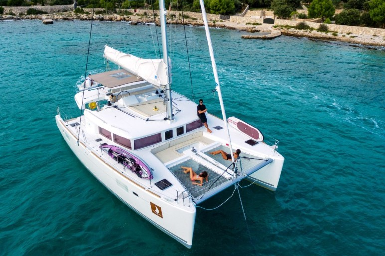
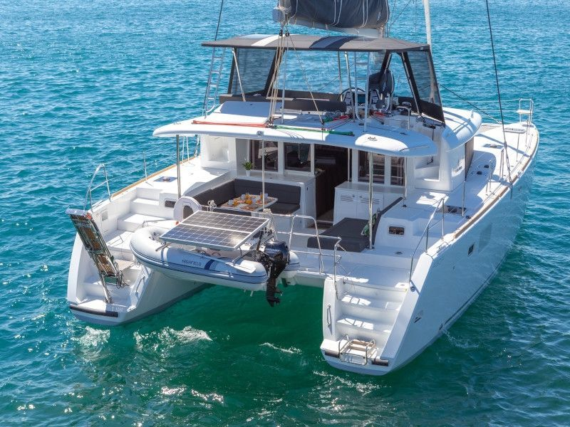
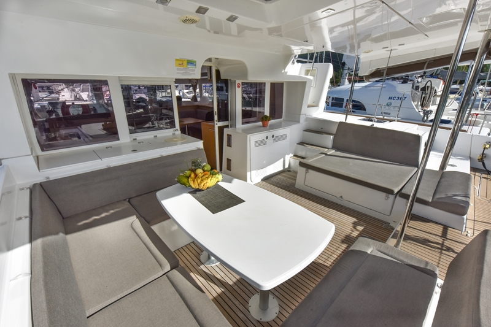
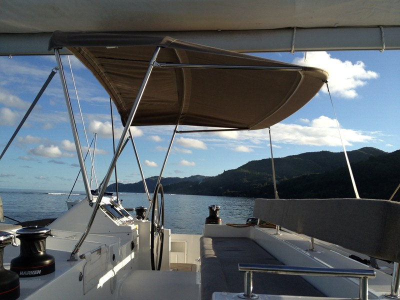
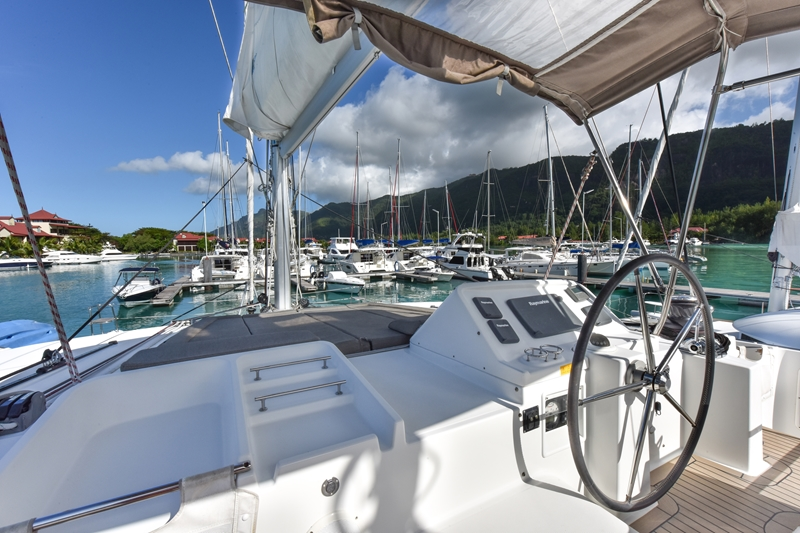
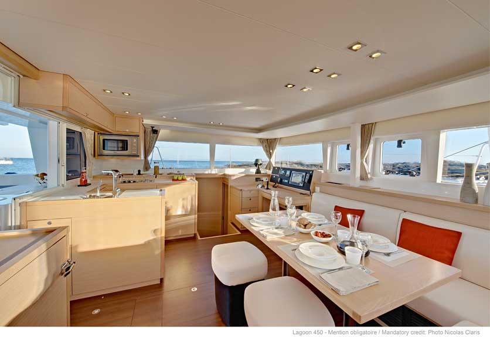
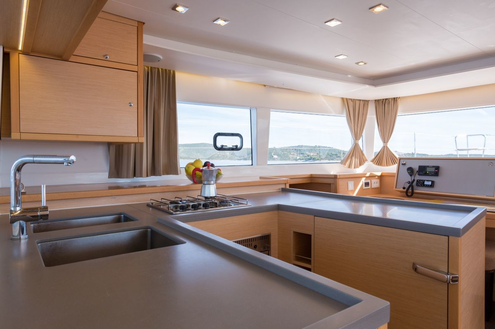
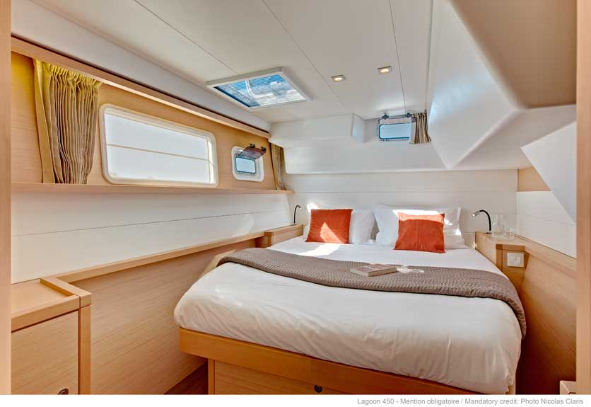
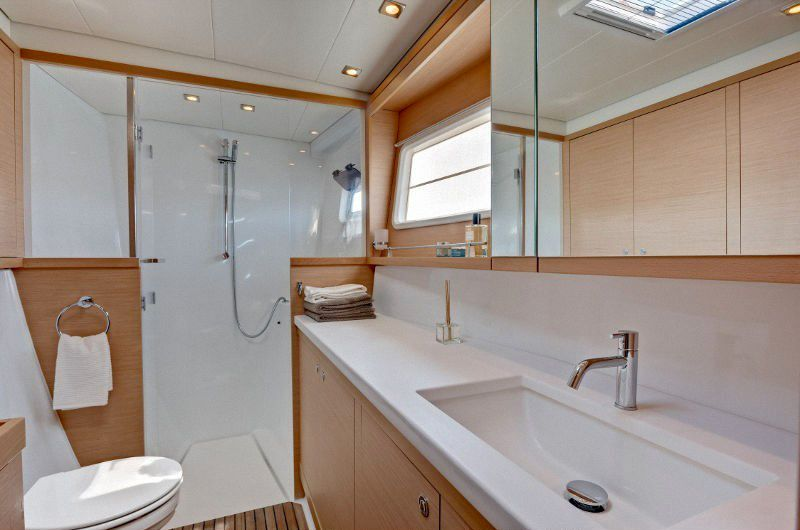
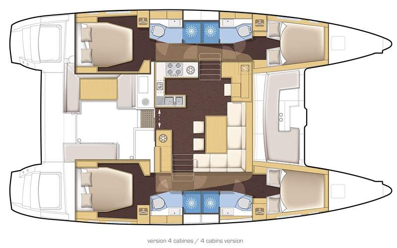

# Jaki rejs?
Najprawdziwszy rejs, najprawdziwszymi jachtami, wyczarterowanymi i prowadzonymi przez nas, bez żadnych obcych skipperów, instruktorów kulturalno-oświatowych, animatorów czasu wolnego, czy kierowników wycieczek. Inicjatywa całkowicie oddolna.

Zbieramy Koleżanki i Kolegów z MP (*wraz z dowolną liczbą osób towarzyszących*) i w ciągu dnia pływamy **dwoma dużymi** katamaranami pomiędzy wyspami Chorwacji, pijąc zimne napoje w pełnym słońcu; słysząc tylko odgłos fal uderzających o kadłub napędzanego wiatrem statku. Wieczorami stajemy obok siebie w marinach i odpoczywamy, robimy imprezę, albo idziemy w miasto.

Będą okazje do zobaczenia kilku naprawdę fajnych miejsc, wyskoczenia z jachtu stojącego na kotwicy do morza i pływania w jeszcze w miarę ciepłym adriatyku, integracji i poznania - rozentuzjazmowanych okolicznościami - znajomych z pracy od mniej profesjonalnej strony, zapoznania się z ogólnie pojętym żeglarstwem, przepisami, prowadzeniem jachtu, piciem alkoholu... W którąś noc pewnie zwiążemy ze sobą dwa katamarany i rzucimy kotwice w środku zatoki.

Myślę, że spokojnie można powiedzieć (*a Ci, którzy już z nami pływali na pewno chętnie potwierdzą*), że szykuje się *impreza roku*. Docelowy skład **20 osób** (max według dokumentów jachtów to 24 osoby), najlepsi z najlepszych, najsympatyczniejsi z najsympatyczniejszych.

## Czym płyniemy?
Jachty mamy aktualnie dwa:
- Lagoon 450 (rok produkcji **2020**) - <https://www.cata-lagoon.com/en/450-s>
- Lagoon 400 S2 (rok produkcji **2018**) - <https://www.cata-lagoon.com/en/40>

---

||
|:--:| 
| *Cały jacht, z przodu siatki do wypoczynku, wcześniej loża. Osoby na zdjęciu dla skali.* |

---

||
|:--:| 
| *Wspomniana loża dziobowa i siatki* |

---

||
|:--:| 
| *Z tyłu to wygląda tak. Warto zwrócić uwagę na opuszczany na dźwigu ponton z własnym silnikiem. Z lewej strony trap do schodzenia na ląd, z prawej drabinka do wchodzenia na jacht z wody.* |

---

||
|:--:| 
| *W zadaszonym kokpicie znajdzie się miejsce dla całej załogi. Na zadaszeniu widać lampy do oświetlenia kokpitu podczas nocnych rozrywek i jeden z głośników dla tej strefy nagłośnienia (jednej z kilku)* |

---

|  |
|:--:|
| *Przyjemnie prowadzić jacht, siedząc w kilka osób w ustawionym nad kokpitem i mesą mostku* |

---

| |
|:--:|
| *Albo wypoczywać na materacach tuż przed mostkiem* |

---

||
|:--:| 
| *Mesa, przestrzeń wspólna. Po prawej widać też radiostację. Stół ma specyficzną konstrukcję, pozwalającą na opuszczenie do poziomu kanap; a oparcia układają się na stole tworząc dodatkowe miejsca do spania.* |

---

||
|:--:| 
| *W kuchni wszystko czego potrzeba do przygotowania posiłku. Lodówka, zamrażalnik, piekarnik, kuchenka, zlew, etc.* |

---

||
|:--:| 
| *Kajuta dwuosobowa, okna, lampki nocne. Nie widać tego na zdjęciu, ale każda kajuta dwuosobowa ma dwa osobne zestawy pościeli oczywiście.* |

---

||
|:--:| 
| *I osobna łazienka dla każdej z dwuosobowych kajut* |

--- 

> *Tutaj chciałbym zaznaczyć, że to są **dokładnie te modele**, niemniej na zdjęciach zawsze wszystko wygląda lepiej (zwłaszcza na zdjęciach producenta) - ale też spokojnie, patrzcie na lata produkcji - **2020** i **2018**!*

---

### Jak duże te jachty, ile jest miejsc?
Technicznie każdy jacht jest zarejestrowany na **12 osób**, ale realnie **zakładamy po 10**:

- **Cztery kajuty dwuosobowe** *z własną łazienką i prysznicem*, połączone korytarzem i schodami z mesą
- **Dwie kajuty jednoosobowe**, bez łazienki do których wchodzi się z pokładu przez świetlik w suficie - **skajlajt**. Są to pewne minusy, ale pojedyncza kajuta jest też plusem.
- **Dwa miejsca w mesie** (salon taki) - stół opuszcza się do poziomu kanapy i powstaje dwuosobowa koja.  
  >*Nie biorę tych miejsc pod uwagę i zakładam, że pozostają puste, niemniej gdyby ktoś bardzo chciał dołączyć w ostatniej chwili, to oczywiście są dostępne, tylko musi pamiętać, ze mesa zamyka imprezę.*

#### Jak wygląda kajuta dwuosobowa?
Jak widać na zdjęciach producenta jest jedno kojo duże. W niektórych przypadkach są też [koje z możliwością rozdzielenia](https://www.blue-sails.com/wp-content/uploads/2018/09/int_45R0355_L450.jpg), ale tego nie gwarantuję.

>Uprzedzając wątpliwości - wiem, że jeśli jedziemy na wyjazd ze znajomymi z pracy, to zazwyczaj nie śpimy z nimi w jednym łóżku. Różnica jest taka, że to nie jest łóżko, tylko podwójna koja i nie pokój w hotelu tylko kajuta. To jest sport i tak to w tym sporcie wygląda. Będziemy rozkładać osoby w taki sposób, żeby każdy czuł się komfortowo.

#### Jak wygląda sytuacja z łazienką dla kajut jednoosobowych?
**Na jachcie są tylko cztery łazienki** - te przypisane do kajut dwuosobowych. Osoby z kajut jednoosobowych korzystają z łazienek w kajutach dwuosobowych. Poza tym prawie codziennie będziemy cumować w marinach, gdzie **dostępne będą sanitariaty**.

# Kiedy?

Impreza dzieje się w październiku **09.10 - 16.10** (sobota - sobota):
- **Zaokrętowanie** (zasiedlenie) powinno być możliwe wczesnym popołudniem **09 października (sobota)**
- Żeglugę rozpoczynamy następnego dnia, w **niedzielę** około **10 rano**  
  >Tak, żeby wszyscy którzy popili zaraz po przyjeździe zdążyli dojść do siebie, Ci co zapomnieli o czymś super ważnym do kupienia zdążyli wstać rano kupić i wrócić, spóźnieni zdążyli dojechać etc..
- Żeglugę kończymy w **piątek** wieczorem
- **Wyokrętowanie** (opuszczenie jednostki) musimy przeprowadzić do **9:00 16 października (sobota)**
- Po wyokrętowaniu będę musiał załatwić jeszcze kilka spraw formalnych, co zajmie mi pewnie do dwóch godzin i możemy jechać

# Gdzie?
Chorwacja, Dalmacja środkowa. Pływamy od wyspy do wyspy - zazwyczaj w ciągu dnia. Czasem jakaś zatoka i postój na kotwicy.

## Start i koniec

Startujemy z **Trogiru** i **Splitu** w zależności od jachtu:
- Lagoon 450 - **ACI Trogir**, Put Cumbrijana, 21220, Trogir
- Lagoon 400 S2 - **ACI Marina Split**, Uvala Baluni 8, 21000, Split

Mariny są od siebie oddalone o 30 km trasą samochodową

## Trasa
To nie jest na razie wiadome i zależeć będzie od pogody jaką zastaniemy, ale podam hasłowo możliwe lokalizacje:
- Starigrad
- Zadar
- Kornati
- Szybenik
- Skradin (+ wodospady Krka)
- Vis
- Hvar
- Jelsa
- Bol

Należy wybrać sobie jakieś 4 z powyższych

Jeśli ktoś chce sobie wyobrazić zasięg, to można bezpiecznie przyjąć, że poruszamy się po wodzie co najmniej **5 kn** i nie więcej niż **10 kn** (węzłów, czyli mil morskich na godzinę; mila to 1,852km) czyli **9,26 km/h** - **18,52 km/h** i nie dłużej niż **10h dziennie**

# Za ile?
Kosztów mamy trzy rodzaje (plus wydatki własne):

## Miejsce na jachcie
Czyli tzw. kojowe. Z tego opłacamy czarter jachtu i koszty operacyjne z tym związane, pośrednika etc..

W zależności od wybranego miejsca (patrz opis jachtu) w kajucie..:

- 1 osobowej - **1300 zł**
- 2 osobowej - **1500 zł**

Płatne w 2 ratach:
- 500 zł - jak najszybciej, celem zarezerwowania miejsca *(przepadająca w przypadku rezygnacji)* *
- reszta - do *15.09*, kwota w zależności od wybranego miejsca

\* \- *Zaliczka jest przepadająca, ponieważ jacht kosztuje tyle samo niezależnie od tego ile osób nim popłynie, a cena za osobę jest stała, więc koniecznym jest zapewnienie za te pieniądze atrakcyjniejszych warunków dla osób, które trzeba będzie znaleźć na zastępstwo.* 

## Składka jachtowa
To jest składka załogi danej jednostki na różne wydatki związane z pobytem na jachcie. Między innymi:
- Ubezpieczenie turystyczne załogi (koszty leczenia, ratownictwo, NNW, OC, bagaż)
- Podatek turystyczny
- Sprzątanie końcowe
- Wypożyczenie silnika zaburtowego do pontonu
- Pościel, ręczniki
- Żywność
- Alkohole
- Opłaty za postój w portach
- Koszty paliwa

Ile tego wyjdzie dokładnie jest jeszcze niewiadomą, ponieważ nie wiemy ile zużyjemy paliwa, ile zakupów spożywczych trzeba będzie zrobić w trakcie rejsu i ile alkoholu pójdzie, ale można się spodziewać nie więcej niż **750 zł**.

Zaczynamy od około **500 zł** bezpośrednio przed rejsem (najlepiej podczas spotkania przedrejsowego):
- **50 €** na rzeczy typu pościel, ręczniki, podatek turystyczny, ubezpieczenia...
- **200 zł** na zakupy spożywcze w Polsce
- **100 kun** na zakupy spożywcze w Chorwacji (jeszcze przed rejsem)

## Dojazd
Z Krakowa jest około **1200 km** drogą lądową. Myślę, że najlepiej przez:
- Polskę - 147 km, bramki 40 zł
- Czechy - 233 km, winieta 50 zł
- Austrię - 317 km, winieta 42 zł
- Słowenię - 67 km, winieta 66 zł
- Chorwację - 454 km, bramki 130 zł

> Warto mieć na uwadze, że winiety są na 10 dni, więc wystarczą też na powrót

Jest kilka osób jadących swoimi samochodami i chętnych do zabrania pasażerów. Niektórzy są chętni do jazdy w piątek rano i postoju na noc w okolicach Słowenii, inni chcą jechać "na raz" - wybór jest duży i na pewno uda się bez problemu wszystkich dograć.

## Podsumowanie
W całości - z pominięciem wyjść do knajp (**pełne wyżywienie jest na jachcie w ramach składki**) - wychodzi realnie *za wszystko* w granicach **2200 zł - 2700 zł**.

# FAQ - często zadawane pytania

## Czy w październiku nie jest za zimno na takie zabawy?
*Zdecydowanie nie jest za zimno, zwłaszcza, że to pierwsza połowa października. Co prawda woda już się robi chłodna, ale spokojnie można jeszcze pływać.*

## W co się ubrać?
*Koszulki z krótkim rękawem, krótkie spodnie, spódniczki, sukienki etc., to są stroje na październik w Chorwacji - niemniej oczywiście coś ciepłego też warto zabrać, bo chłodno też bywa, a nawet jeśli nie, to sam wiatr na otwartym akwenie, nawet w pełnym słońcu potrafi wychłodzić*

## Czy jeśli realnie startujemy w niedzielę, to mogę przyjechać w niedzielę rano?
*Nie można, w sobotę będą:*
- *Szkolenia BHP*
- *Tłumaczone zasady życia na jachcie*
- *Wykład o działaniu jachtu*
- *Podział na **wachty** (zmiany), zwłaszcza w kwestii **kambuzu** (kuchni)*

*Oczywiście jeśli ktoś będzie miał sytuację, że nie może inaczej niż w niedzielę, albo coś się wysypie i nie zdąży to nic się strasznego nie stanie, ale nie jest to sytuacja pożądana. Jeśli natomiast ktoś się spóźni bardziej niż południe w niedzielę, to będzie musiał nas łapać w innym porcie na jakiejś wyspie. Promy są, więc dostanie się bez (**ekstra dużego**) problemu.*

## Co to znaczy, że kończymy żeglugę w piątek?
*To znaczy, że w piątek wieczorem musimy być już w porcie, żeby uniknąć sytuacji w której spóźnimy się ze zdaniem jachtu w sobotę rano, ponieważ armator musi zdążyć przygotować jednostkę na kolejny czarter.*

- Czy w takim razie nie możemy się zatrzymać gdzieś obok portu i rano szybko przepłynąć na miejsce?  
*Nie możemy ponieważ do powrotu do portu w piątek zobowiązuje mnie umowa czarterowa*

- Czy to znaczy, że w piątek już nic się nie dzieje?  
*Nie, w piątek wieczorem po zaparkowaniu jachtu idziemy na miasto wspominać jak było super.*

- Czy to znaczy, że w piątek śpimy w hotelu?  
*Nie, w piątek śpimy normalnie na jachcie. Musimy go tylko opuścić przed **10 rano***

- Czy jeśli kończymy żeglugę w piątek, to mogę już wtedy pojechać do domu/gdziekolwiek indziej?  
*Jeśli masz transport to tak, jak najbardziej, ale wszystkim będzie przykro :D*

## Co jest dostępne w marinie?

Marina to jest taka wydzielona część portu, gdzie mogą stawać jachty turystyczne (port jako taki, jest przede wszystkim instytucją handlową). W marinie znajdziemy:
- Pomocną obsługę
- Sanitariaty
  - toalety
  - prysznice
  - pralki
  - etc..
- Podpięcie jachtu do prądu i wody

**ACI** to jest takie Chorwackie zrzeszenie droższych marin - **Adriatic Croatia International Club** (https://aci-marinas.com/). Są trochę wyższej klasy, ale właściwie nas to nie obchodzi, bo jedziemy tam siedzieć na jachcie a nie podziwiać armaturę w łazienkach.
